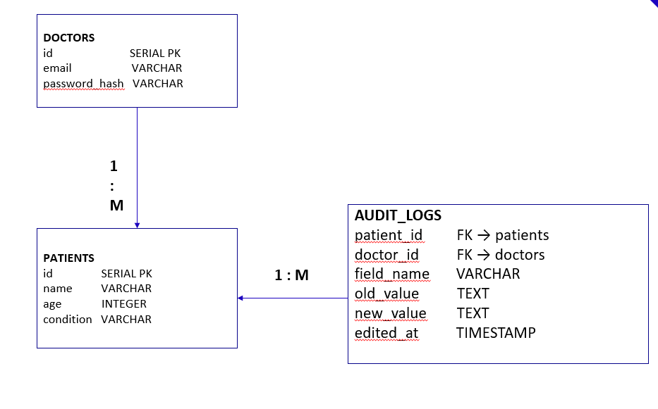
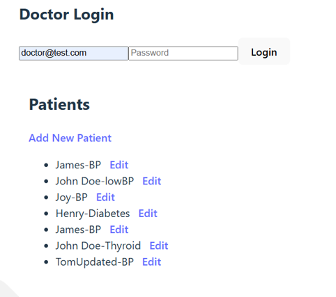
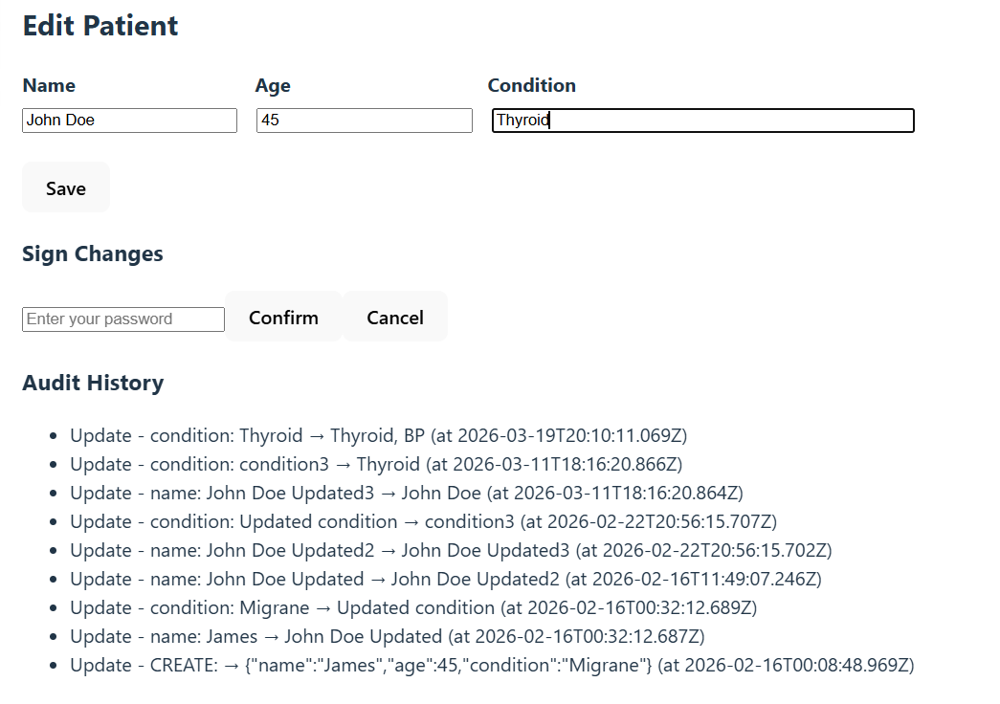

# Patient Management System

A simple full-stack web application for doctors to manage patient records with JWT-based authentication, CRUD operations, field-level audit logging, and digital signature verification on updates.
Every change to a patient record is tracked with the doctor's identity, old value, and new value.

---

## Tech Stack

| Layer | Technology |
|---|---|
| Frontend | React, TypeScript, Vite, React Router v6 |
| Backend | Node.js, Express, TypeScript |
| Database | PostgreSQL |
| Auth | JSON Web Tokens (jsonwebtoken) |
| Password Hashing | bcrypt |
| HTTP Client | Axios |
| Environment Config | dotenv |

---

## Setup and Run

### Prerequisites
- Node.js v18+
- PostgreSQL running locally

### 1. Clone the repository
```bash
git clone <repo-url>
cd NodeJS
```

### 2. Backend Setup
```bash
cd backend
npm install
```

Copy the example env file and fill in your values
`.env` values to fill:
```
DB_USER=postgres
DB_HOST=localhost
DB_NAME=Doctordetails
DB_PASSWORD=your_password
DB_PORT=5433
JWT_SECRET=your_secret_key
```

Start the backend:
```bash
npm run dev
```
Server runs on `http://localhost:4000`

### 3. Frontend Setup
```bash
cd frontend
npm install
npm run dev
```
App runs on `http://localhost:5173`

### 4. Database
Create a PostgreSQL database named `Doctordetails` with the below schema.



---

## API Endpoints

| Method | Endpoint | Auth | Description |
|---|---|---|---|
| POST | /auth/login | No | Doctor login, returns JWT token |
| GET | /patients | Yes | Get all patients |
| GET | /patients/:id | Yes | Get single patient by ID |
| POST | /patients | Yes | Create new patient |
| PUT | /patients/:id | Yes | Update patient with digital signature |
| GET | /patients/:id/history | Yes | Get audit history for a patient |

---


## Architecture

- Monorepo structure — frontend and backend are separate folders under one repository, each with their own package.json, tsconfig.json, and dependencies
- REST API design — backend exposes 6 endpoints over HTTP; frontend communicates exclusively through Axios calls in api/ layer, keeping API logic separate from UI components
- JWT stateless authentication — server issues a signed token on login; every protected request carries it in the Authorization header; middleware verifies it before the request reaches any controller
- Layered backend — requests flow through routes → middleware → controllers → database, each layer with a single responsibility; no business logic lives in route definitions
- Audit-first data model — audit_logs table is a first-class entity linked to both doctors and patients via foreign keys; every create and field-level update writes a record atomically in the same database transaction

---

## Project Flow

- Authentication — doctor submits credentials; backend queries doctors table, verifies password with bcrypt, returns a JWT token stored in localStorage on the frontend.
- Route protection — all /patients routes pass through authMiddleware which decodes the JWT and attaches doctorId to the request; unauthenticated requests are rejected with 401 before reaching any controller.
- Patient CRUD — PatientList fetches all records on mount; PatientCreate posts a new record; both createPatient and updatePatient wrap their DB operations in a transaction to ensure the audit log is always written together with the data change.
- Digital signature on update — before any patient record is updated, the doctor re-enters their password; backend re-verifies it with bcrypt against the stored hash, treating it as a digital signature confirming the change.
- Field-level audit trail — on update, the controller fetches the old record, compares each field individually, and inserts one audit_log row per changed field with old_value and new_value; the full history is displayed in AuditHistory component on the edit page.

---

## State Management

State is managed locally at the component level using React `useState` — no global state library is used. Each page owns the data it needs:
- `PatientList` holds the `patients[]` array fetched on mount
- `PatientEdit` holds the current `patient` object, `history[]`, loading, saving, and error states
- `PatientCreate` holds the form fields as a single `patient` object

Authentication state (JWT token) is stored in `localStorage` and read directly by each component and API call. This keeps the implementation simple while the app remains small.

---

## Frontend–Backend Communication

The frontend communicates with the backend exclusively through Axios, with all API calls isolated in `frontend/src/api/`:
- `authApi.ts` handles login
- `patientApi.ts` handles all patient and history calls

Every protected request attaches the JWT token via an `Authorization: Bearer <token>` header using a shared `authHeader()` helper. The backend `authMiddleware` intercepts each request, verifies the token, and injects `doctorId` into the request object before passing it to the controller. If the token is missing or invalid, the request is rejected with a `401` response before any database query runs.

---

## Results



